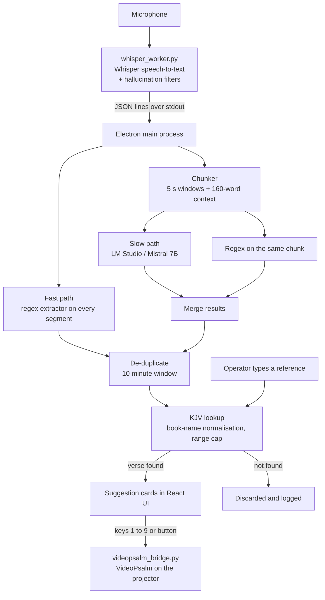
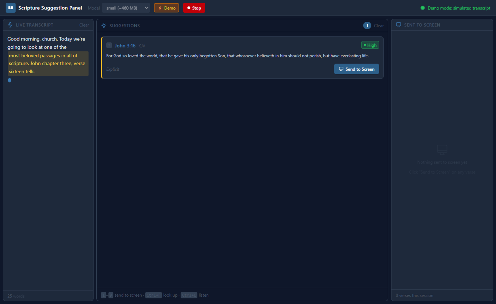

# Scripture Suggestion Panel

A desktop assistant for church media operators. It listens to a live sermon, recognises Bible references as they are spoken, and shows the verse text so the operator can put it on screen with one keypress.

- **Local only.** Speech recognition, reference detection and the Bible database all run on the operator's machine. No audio leaves the room.
- **Two detection paths.** A fast rule-based path catches explicit citations ("John 3:16") in microseconds. An optional local language model catches paraphrases and allusions.
- **Built for a live booth.** Number keys send a suggestion to [VideoPsalm](https://www.videopsalm.com/), a manual lookup box covers anything the detector misses, and every failure mode degrades instead of stopping the app.


---

## Contents

- [Built with](#built-with)
- [Process flow](#process-flow)
- [Input and output](#input-and-output)
- [Performance](#performance)
- [Evaluation rubric](#evaluation-rubric)
- [File structure](#file-structure)
- [Setup](#setup)
- [Using it during a service](#using-it-during-a-service)
- [Configuration](#configuration)
- [Troubleshooting](#troubleshooting)
- [Limitations and future work](#limitations-and-future-work)
- [Development workflow](#development-workflow)
- [References](#references)

---

## Built with

| Layer | Technology | Role |
|---|---|---|
| Desktop shell | [Electron](https://www.electronjs.org/) 42 | Main process, child-process supervision, secure IPC (`contextIsolation`) |
| User interface | [React](https://react.dev/) 19, [Tailwind CSS](https://tailwindcss.com/) 4 | Three-panel operator UI |
| Build tooling | [Vite](https://vite.dev/) 8, [electron-vite](https://electron-vite.org/) 5, electron-builder | Dev server, bundling, Windows packaging |
| Speech-to-text | Python, [OpenAI Whisper](https://github.com/openai/whisper), sounddevice, NumPy | Local transcription of microphone audio |
| Reference detection | JavaScript regular expressions | Fast path for explicit citations |
| Language model | [LM Studio](https://lmstudio.ai/) with Mistral 7B Instruct (optional) | Slow path for paraphrases and allusions, via an OpenAI-compatible API |
| Bible data | KJV from [scrollmapper/bible_databases](https://github.com/scrollmapper/bible_databases), [sql.js](https://sql.js.org/) | 31,102 verses in a local SQLite file |
| Presentation | pywin32, pywinauto, psutil | Types the reference into VideoPsalm (Windows) |

---

## Process flow



**Why two paths.** Most references in a sermon are spoken explicitly ("turn to Romans 8:28"). A regular expression finds these almost instantly and needs nothing but the transcript. Paraphrases ("God works all things for good") need a language model, which is slower and may not be running. Splitting the work means the app is useful on any machine, and the language model only adds coverage, never a dependency.

**Why the database check matters.** A detection only becomes a card if the verse exists. This filters impossible references (for example "Isaiah 700") and anything the language model invents, which is a known failure mode of generative models.

**Handling Whisper's weak spots.** Whisper can invent text during silence or noise ([Koenecke et al., 2024](#references)). The worker applies an energy gate, disables conditioning on previous text, and keeps only segments where Whisper's own no-speech probability is below 0.5 and mean log-probability is above -0.8. These are tighter than the fallback thresholds used in the Whisper paper (0.6 and -1.0; [Radford et al., 2022](#references)).

---

## Input and output

### Input

Live microphone audio. The Whisper worker turns it into short text segments like these:

```text
Good morning, church. Today we're going to look at one of the most beloved passages
turn with me to John 3:16 for God so loved the world
First Corinthians 13 verse 4 love is patient
Romans 12 2 be not conformed to this world          <- Whisper dropped the colon
```

The operator can also type a reference such as `Romans 8:28-30` or `first corinthians 13 verse 4`.

### Output

Each detection becomes a suggestion card:

| Field | Example | Meaning |
|---|---|---|
| Reference | `1 Corinthians 13:4` | Canonical book name, chapter and verse range |
| Text | `Charity suffereth long, and is kind...` | KJV verse text from the local database |
| Confidence | High / Med / Low | How sure the detector is (see below) |
| Trigger | Explicit / Paraphrase / Allusion | How the verse was referenced |
| Hotkey | `1` to `9` | Press to send to VideoPsalm |

| Confidence | Assigned when |
|---|---|
| **High** | Explicit citation with a clear verse ("John 3:16", "John 3 verse 16"), a direct quote, or a manual lookup |
| **Med** | Verse separator missing ("John 3 16"), or a paraphrase |
| **Low** | Bare chapter ("Romans 8") or an allusion |

### Screenshots

Transcript arriving, first suggestion shown:



About 45 seconds later. Each card appears only after the words that cite it are transcribed, and it shares a colour with that passage (yellow for John 3:16, blue for Psalm 23, pink for Romans 8:28, and so on). Verses the operator used are kept in the history panel on the right:


Screenshots come from the built-in demo mode and can be regenerated with `npm run screenshots`.

---

## Performance

### Method

Reference detection is treated as an information-retrieval task and scored with precision, recall and F1 ([Manning et al., 2008](#references)):

- **Precision**: of the references the system showed, how many were correct.
- **Recall**: of the references actually spoken, how many the system found.
- **F1**: the harmonic mean of the two.

The test set ([`scripts/eval-set.json`](scripts/eval-set.json)) has 62 hand-labelled utterances written in the style of Whisper output: explicit citations, spoken "verse", ordinal and Roman-numeral book names, missing colons, ranges, abbreviations, several references on one line, and ordinary speech that looks like a reference ("I want to mark 3 things"). Hard cases the current rules are known to miss are included on purpose so the score is not inflated.

Run it with `npm run eval`.

### Results (regex path)

Evaluation set: 62 utterances (48 with references, 14 without), 50 gold references.

| Stage | Precision | Recall | F1 | TP | FP | FN |
|---|---|---|---|---|---|---|
| Extraction (regex) | 89.8% | 88.0% | 88.9% | 44 | 5 | 6 |
| Validated (regex + KJV lookup) | 91.7% | 88.0% | 89.8% | 44 | 4 | 6 |

False alarms on ordinary speech: 2 of 14 negative utterances (14.3%).

| Category | Gold refs | Found | Recall |
|---|---|---|---|
| colon | 12 | 12 | 100.0% |
| spoken verse | 6 | 5 | 83.3% |
| numbered book | 8 | 8 | 100.0% |
| missing colon | 4 | 4 | 100.0% |
| range | 6 | 5 | 83.3% |
| multiple | 4 | 4 | 100.0% |
| abbreviation | 3 | 3 | 100.0% |
| bare chapter | 3 | 3 | 100.0% |
| hard | 4 | 0 | 0.0% |

**What the errors are.** The misses are numbers spoken as words ("John three sixteen"), a full stop instead of a colon ("John 3.16"), ranges joined with "and" ("verses 8 and 9"), and single-chapter books cited by verse only ("Jude verse 24"). The two false alarms are "numbers 4 5 and 6" and "call Daniel 4 times", where a book name is also an everyday word. Each of these has a clear rule-based fix, listed under [future work](#limitations-and-future-work).

### Speed of the detection logic

| Stage (1000 runs) | p50 | p95 |
|---|---|---|
| Regex extraction per segment | 1.6 µs | 3.9 µs |
| KJV lookup per reference | 48.3 µs | 138.3 µs |

Measured on a Windows 11 desktop CPU. The regex is compiled once at start-up and the database is held in memory, so detection adds well under a millisecond.

### End-to-end latency (estimate)

Speech to card is dominated by audio buffering and Whisper inference, not detection. These figures are estimated from the configuration, not measured with live audio:

| Stage | Fast path | LLM path |
|---|---|---|
| Audio window (`--chunk-secs 6.0`) | up to 6 s | up to 6 s |
| Whisper `small` on CPU | 2 to 6 s | 2 to 6 s |
| Chunker interval | none | 0 to 5 s |
| LM Studio, 7B model | none | 2 to 5 s |
| Regex + KJV lookup | < 1 ms | < 1 ms |
| **Total** | **about 8 to 12 s** | **about 10 to 22 s** |

### Unit tests

`npm test` runs 40 regression checks covering book-name normalisation, extraction, confidence levels, parsing of truncated LLM output, verse-range capping and end-to-end transcript-to-verse lookups. All pass.

---

## Evaluation rubric

How the system is judged. Targets are set from the operator's needs and from published guidance on response times ([Nielsen, 1993](#references)): about 0.1 s feels instant, and about 10 s is the limit for keeping a user's attention on a task.

| # | Criterion | How it is measured | Target | Result | Status |
|---|---|---|---|---|---|
| 1 | Detection accuracy (explicit references) | F1 on the labelled set, `npm run eval` | F1 of 85% or more | 89.8% | Met |
| 2 | False alarms on ordinary speech | Share of negative utterances that produce a card | 10% or less | 14.3% (2 of 14) | Not yet met |
| 3 | Correct verse text | Every card comes from the KJV database. Invented or impossible references are dropped. Checked by `npm test` | 100% of cards resolve to a real verse | 40 of 40 checks pass | Met |
| 4 | Detection speed | p95 of regex + lookup, `npm run eval` | Under 100 ms (feels instant) | about 0.14 ms | Met |
| 5 | Speech-to-card latency | Stage budget above | 10 s or less on the fast path | about 8 to 12 s (estimate) | Partly met |
| 6 | Robustness | App keeps working when LM Studio is off, VideoPsalm hangs (5 s timeout and restart), or Whisper falls behind (bounded queue drops oldest audio) | No single failure stops detection | Each case handled in code and logged | Met |
| 7 | Privacy | All processing is local. The only network call goes to the LM Studio endpoint, `localhost` by default | No audio or text leaves the machine | Met by design | Met |
| 8 | Operator effort | Actions needed to show a suggested verse | One keypress | Keys 1 to 9, plus Ctrl+F manual lookup | Met |

---

## File structure

```text
scripture-app/
├── src/
│   ├── main/                    Electron main process (Node.js)
│   │   ├── index.js             App entry: IPC, Whisper and VideoPsalm process supervision, pipeline wiring
│   │   ├── bibleExtractor.js    Fast path: regex reference extraction and confidence
│   │   ├── bookNames.js         The 66 books and their spoken / written aliases (single source of truth)
│   │   ├── bibleDb.js           KJV lookup through sql.js, range capping
│   │   ├── llmClient.js         Slow path: LM Studio client, prompt, tolerant JSON parsing
│   │   ├── chunker.js           Groups transcript text into 5 s chunks for the LLM
│   │   ├── settings.js          Saved preferences (model, input device, endpoint)
│   │   └── logger.js            Rotating file log
│   ├── preload/index.js         The only API the UI can call (contextBridge)
│   └── renderer/                React UI
│       ├── index.html
│       └── src/
│           ├── App.jsx          State, IPC events, keyboard shortcuts, demo mode
│           ├── components/      Header, ManualSearch, TranscriptPanel, SuggestionPanel,
│           │                    ScriptureCard, SelectedQueue (sent history)
│           └── data/mockData.js Demo sermon and suggestions
├── python/
│   ├── whisper_worker.py        Microphone capture and Whisper transcription
│   ├── videopsalm_bridge.py     Sends a reference to VideoPsalm (Windows)
│   ├── list_devices.py          Lists microphones as JSON
│   ├── requirements.txt
│   └── setup.bat / setup.sh     Python dependency install
├── scripts/
│   ├── setup-bible-db.js        Builds bible-data/kjv.db (one-time)
│   ├── selftest.js              Regression tests (npm test)
│   ├── evaluate.js              Precision, recall, F1 and latency (npm run eval)
│   ├── eval-set.json            Labelled evaluation utterances
│   ├── capture-screenshots.js   Regenerates the README screenshots
│   └── electron-stub.js         Lets main-process modules run under plain Node
├── docs/screenshots/            Images used in this README
├── resources/                   App icons
├── .github/workflows/ci.yml     Runs tests, evaluation and build on every push
├── electron.vite.config.mjs
└── package.json
```

---

## Setup

### Requirements

| | Required | Notes |
|---|---|---|
| Windows 10 or 11 | Yes | VideoPsalm integration is Windows-only. Everything else runs on macOS and Linux. |
| Node.js 18+ | Yes | Runs and builds the app |
| Python 3.9 to 3.11 | Yes | Speech-to-text |
| About 3 GB disk | Yes | PyTorch (about 2 GB) plus a Whisper model |
| VideoPsalm | Optional | For Send to Screen. Copy and paste works without it. |
| LM Studio | Optional | For paraphrase detection. Explicit references work without it. |
| NVIDIA GPU | Optional | Faster transcription. CPU is fine with the `small` model. |

### Steps

```bash
npm install
```

```bash
pip install -r python/requirements.txt
```

On Windows you can run `python\setup.bat` instead. The first install downloads PyTorch, which is by far the slowest step.

```bash
npm run setup-bible
```

This downloads the KJV and writes `bible-data/kjv.db` (about 5.6 MB). It is a one-time step and the file is not stored in git.

**Optional, for paraphrase detection:** install [LM Studio](https://lmstudio.ai/), download Mistral 7B Instruct, load it and start the local server (default `http://localhost:1234`). The app finds the loaded chat model automatically.

### Run

```bash
npm run dev
```

Without a microphone or Python, the app runs in **demo mode** with a simulated sermon. Toggle it with the Demo button or `Ctrl+D`.

### Test and evaluate

```bash
npm test
```

```bash
npm run eval
```

### Build a Windows release

```bash
npm run dist:win
```

Output goes to `dist-electron/` as an unsigned zip, so Windows SmartScreen will warn on first run.

---

## Using it during a service

**Before the service:** choose the input device and Whisper model in the header, click **Listen**, and check that words appear in the transcript. Both choices are saved for next time.

**During the service:**

| Key | Action |
|---|---|
| `1` to `9` | Send that suggestion to VideoPsalm |
| `Ctrl+F` | Jump to the manual lookup box |
| `Ctrl+L` | Start or stop listening |
| `Ctrl+D` | Toggle demo mode |
| `Esc` | Dismiss a message (never clears suggestions) |

If the detector misses a verse, type it in the lookup box. Manual entries are marked `manual` and always treated as high confidence.

---

## Configuration

### Whisper model

| Model | Size | CPU speed | Use when |
|---|---|---|---|
| `tiny` | 75 MB | Fastest | Weak machine, clear audio |
| `base` | 140 MB | Fast | Low-spec booth PC |
| `small` | 460 MB | Moderate | **Recommended default** |
| `medium` | 1.5 GB | Slow on CPU | You have a GPU |
| `large-v3` | 3 GB | Very slow on CPU | GPU only |

If the app shows **"Transcription is falling behind"**, the model is too heavy for the machine. The worker drops the oldest audio so it never falls further behind, but a smaller model is the real fix.

### Settings and logs

Saved in Electron's userData folder (`%APPDATA%\scripture-app` on Windows):

- `settings.json`: Whisper model, input device, LM Studio endpoint. Delete it to reset.
- `logs/scripture-app.log`: detections, failed lookups, LLM and VideoPsalm errors. Rotates at 5 MB and keeps 3 files.

---

## Troubleshooting

| Symptom | Fix |
|---|---|
| "Python not found" | Reinstall Python with "Add Python to PATH" ticked. |
| No devices in the Input list | Run `python python/list_devices.py`. If it is empty, check microphone privacy settings. Speaker loopback devices are hidden on purpose. |
| Transcript stays empty | Wrong input device or very quiet audio. For quiet sources: `python python/whisper_worker.py --model small --vad-threshold 0.002` |
| Verses arrive too late | Use a smaller model, or a shorter window: `--chunk-secs 4.0 --beam-size 1` |
| "No Bible DB" badge | Run `npm run setup-bible`. |
| LM Studio dot is red | Start the server in LM Studio (not just the app) and load a chat model. Click "LM Studio" in the header to change the endpoint. |
| Send to Screen does nothing | VideoPsalm must be open with its reference box visible. If it stops responding, the bridge times out after 5 s and restarts. |

---

## Limitations and future work

- **Regex gaps.** Add number-word parsing ("three sixteen"), accept `.` as a verse separator, handle "verses 8 and 9" as a range, and treat "Jude verse 24" as chapter 1 for single-chapter books. These cover every miss in the current evaluation.
- **False alarms.** Require a verse number for "Numbers" and "Daniel" as well, since both are common words.
- **Latency.** Replace `openai-whisper` with `faster-whisper` or `whisper.cpp` for a large CPU speed-up, which would also allow a shorter audio window.
- **Measure the LLM path.** Record real sermons, label them, and score the paraphrase path the same way.
- **Translations.** KJV only today because it is public domain. The schema has a `translation` column ready for WEB and ASV.
- **Packaging.** No code signing or auto-update yet. VideoPsalm control simulates keystrokes, so it briefly takes focus.

---

## Development workflow

The repository follows **Git Flow** ([Driessen, 2010](#references)): `main` holds releases, `develop` is the integration branch, and work happens on `feature/*`, `bugfix/*` and `release/*` branches merged with `--no-ff`. Commit messages follow [Conventional Commits 1.0.0](https://www.conventionalcommits.org/en/v1.0.0/) (`feat:`, `fix:`, `perf:`, `refactor:`, `docs:`, `test:`, `chore:`). CI runs the tests, the evaluation and a production build on every push.

---

## References

1. Radford, A., Kim, J. W., Xu, T., Brockman, G., McLeavey, C., and Sutskever, I. (2022). *Robust Speech Recognition via Large-Scale Weak Supervision.* arXiv:2212.04356.
2. Koenecke, A., Choi, A. S. G., Mei, K. X., Schellmann, H., and Sloane, M. (2024). *Careless Whisper: Speech-to-Text Hallucination Harms.* Proceedings of the ACM Conference on Fairness, Accountability, and Transparency (FAccT '24).
3. Jiang, A. Q., et al. (2023). *Mistral 7B.* arXiv:2310.06825.
4. Manning, C. D., Raghavan, P., and Schütze, H. (2008). *Introduction to Information Retrieval*, chapter 8, "Evaluation in information retrieval". Cambridge University Press.
5. Nielsen, J. (1993). *Usability Engineering*, chapter 5, "Response times". Academic Press.
6. Driessen, V. (2010). *A successful Git branching model.* nvie.com.

---

## License

[ISC](LICENSE). The King James Version text is in the public domain.
