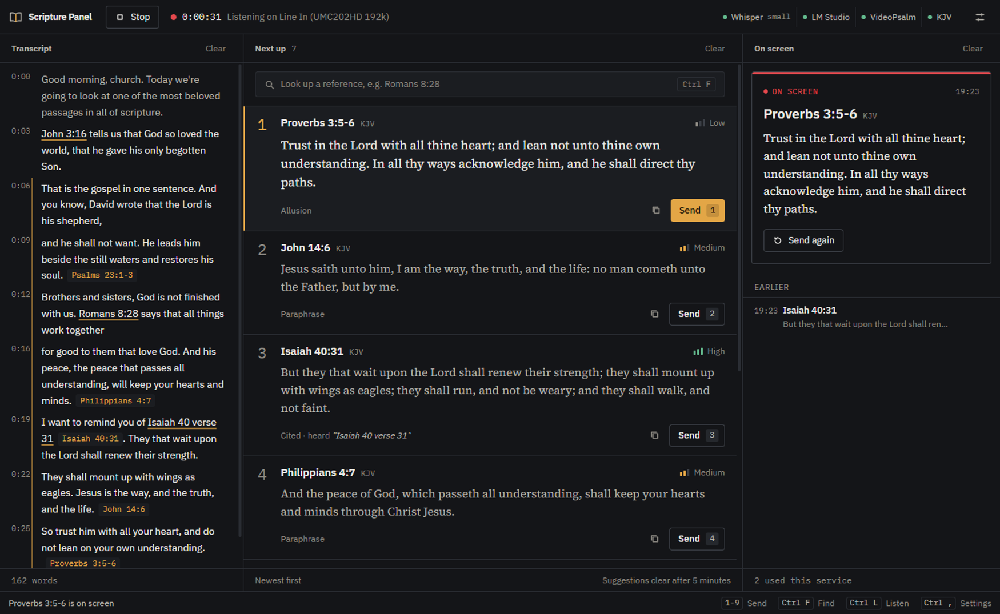
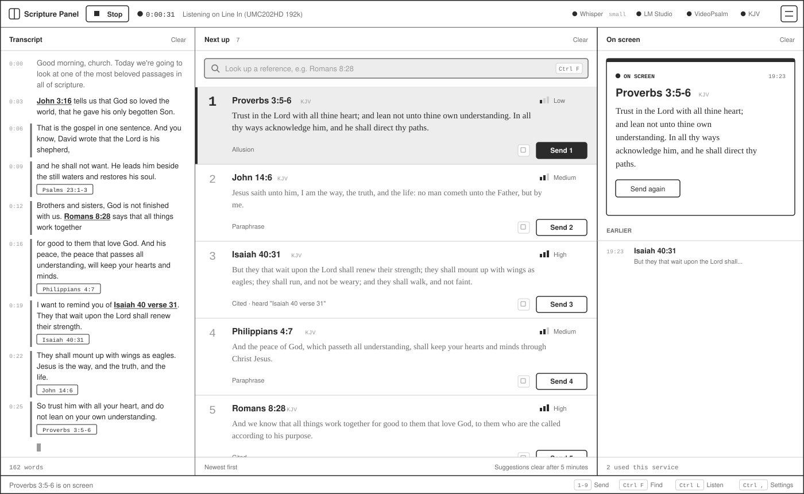
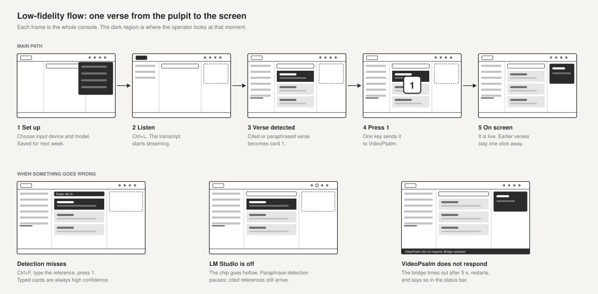
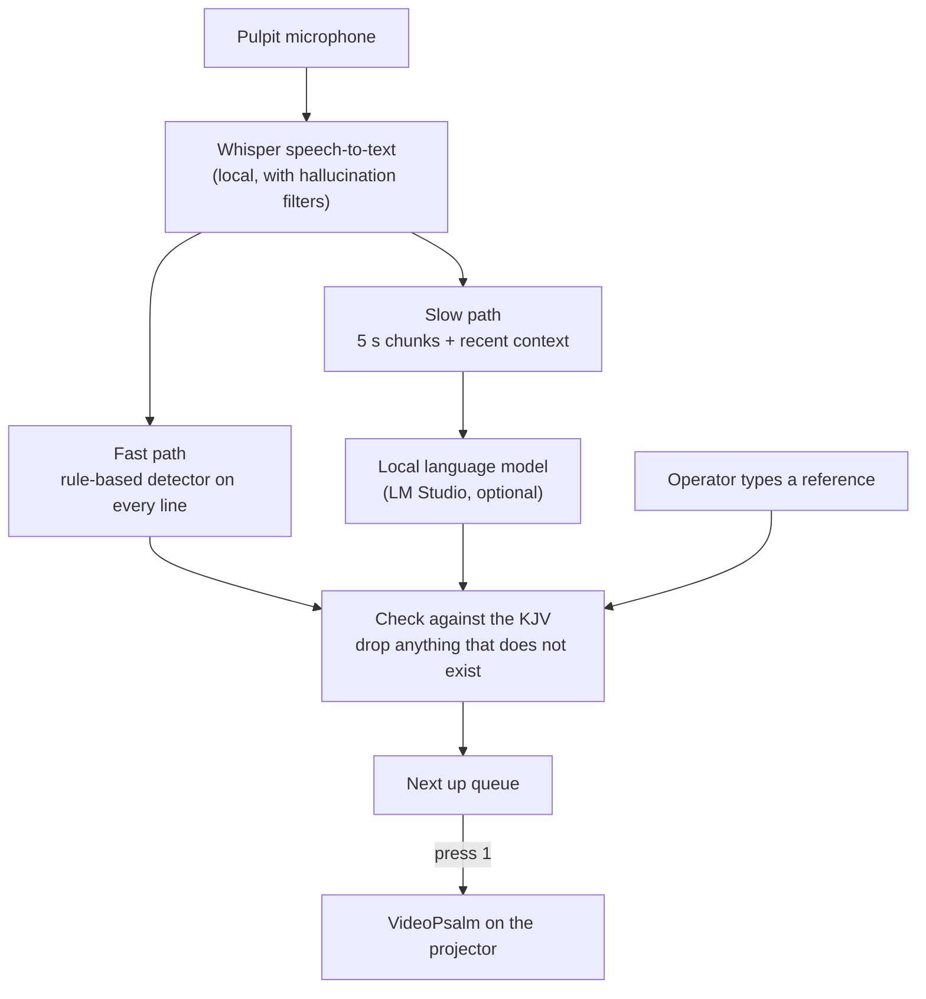

# Scripture Panel

A desktop assistant for church media teams. It listens to the sermon, recognises Bible verses as they are cited or quoted, and puts the right one on screen with a single keypress.



---

## Why I built this

I serve on the media team at my church. Part of our job during a service is putting the scripture on screen as it is read, and week after week I noticed we were falling behind. When the man of God says "turn with me to Romans 8:28", we can usually keep up. But very often he quotes a verse, or puts it in his own words, without naming it at all. Then whoever is at the desk has to recognise the verse, find it and put it up before the moment passes. Most of the time, the moment passes first.

I wanted to see whether software could take some of that load off us: listen alongside whoever is at the desk, notice the verse, and have it ready. Not to replace anyone on the team, but to make it easier for us to keep up with the person preaching, so the word being shared reaches the congregation when it matters.

That is what this project is. I built it around the seat I sit in myself: one person at a desk in a dim room, a keyboard in their lap, listening to the pulpit and watching the screen at the same time.

---

## What it does

- **Hears the verse.** Speech is transcribed locally with Whisper. Explicit citations ("Isaiah 40 verse 31") are picked up in microseconds by a rule-based detector.
- **Catches the quote that was never named.** An optional local language model reads the last few sentences and suggests verses that were paraphrased or alluded to.
- **One key to show it.** The most likely verse is always key `1`. It is typed into [VideoPsalm](https://www.videopsalm.com/) for you.
- **Shows its reasoning.** Every suggestion says how it was found and what was heard, and hovering it highlights the exact words in the transcript.
- **Never leaves the room.** Transcription, detection and the Bible all run on the machine. No audio is uploaded.

---

## Contents

- [From wireframe to app](#from-wireframe-to-app)
- [How it works](#how-it-works)
- [Built with](#built-with)
- [Performance](#performance)
- [Evaluation rubric](#evaluation-rubric)
- [Quick start](#quick-start)
- [Documentation](#documentation)
- [Limitations and what is next](#limitations-and-what-is-next)
- [References](#references)

---

## From wireframe to app

Before building the interface I sketched it in low fidelity: where each thing goes and what the operator does, with no colour or styling. Then I built each screen. The wireframe and the finished screen are the same size, so they line up region for region.

| Low fidelity | High fidelity |
|---|---|
|  |  |

The overall layout and the operator's flow, including what happens when something goes wrong:

| Layout | Operator flow |
|---|---|
|  |  |

Every screen, side by side, and the reasoning behind each decision are in [docs/design.md](docs/design.md).

---

## How it works


```mermaid
flowchart TD
    MIC[Pulpit microphone] --> W["Whisper speech-to-text<br/>(local, with hallucination filters)"]
    W --> FAST["Fast path<br/>rule-based detector on every line"]
    W --> CHUNK["Slow path<br/>5 s chunks + recent context"]
    CHUNK --> LLM["Local language model<br/>(LM Studio, optional)"]
    FAST --> CHECK
    LLM --> CHECK["Check against the KJV<br/>drop anything that does not exist"]
    CHECK --> UI[Next up queue]
    OP[Operator types a reference] --> CHECK
    UI -- "press 1" --> VP[VideoPsalm on the projector]
```

**Why two paths.** Most verses in a sermon are named out loud, and a regular expression finds those almost instantly with no extra software. Quotes and paraphrases need a language model, which is slower and might not be running. Keeping the two separate means the app is useful on any church PC, and the model only adds coverage, never a dependency.

**Why check against the Bible.** A detection only becomes a card if the verse exists. That filters out impossible references ("Isaiah 700") and anything the language model makes up, which is a known weakness of generative models.

**Handling Whisper's weak spots.** Whisper can invent text during silence ([Koenecke et al., 2024](#references)). The worker gates out silent audio, stops Whisper from building on its own earlier output, and keeps only segments Whisper itself is confident about. The thresholds are tighter than the defaults in the Whisper paper ([Radford et al., 2022](#references)).

More detail, including the IPC contract and how each failure is handled, is in [docs/architecture.md](docs/architecture.md).

---

## Built with

| Layer | Technology |
|---|---|
| Desktop shell | [Electron](https://www.electronjs.org/) 42, secure IPC with `contextIsolation` |
| Interface | [React](https://react.dev/) 19, [Tailwind CSS](https://tailwindcss.com/) 4, IBM Plex and Source Serif 4 (bundled) |
| Build | [Vite](https://vite.dev/) 8, [electron-vite](https://electron-vite.org/) 5, electron-builder |
| Speech-to-text | Python, [OpenAI Whisper](https://github.com/openai/whisper), sounddevice, NumPy |
| Detection | JavaScript regular expressions, plus [LM Studio](https://lmstudio.ai/) with Mistral 7B Instruct (optional) |
| Bible | KJV from [scrollmapper/bible_databases](https://github.com/scrollmapper/bible_databases) in SQLite via [sql.js](https://sql.js.org/), 31,102 verses |
| Presentation | pywin32, pywinauto, psutil (types into VideoPsalm on Windows) |
| Quality | Regression tests, a labelled evaluation set, GitHub Actions CI |

---

## Performance

### How it was measured

Reference detection is scored like an information-retrieval task, with precision, recall and F1 ([Manning et al., 2008](#references)):

- **Precision**: of the verses the app suggested, how many were right.
- **Recall**: of the verses actually cited, how many the app found.
- **F1**: the balance of the two.

The test set ([`scripts/eval-set.json`](scripts/eval-set.json)) is 66 sentences I labelled by hand, written the way Whisper outputs speech. It includes cases I know the rules miss and ordinary sentences that only look like references ("I want to mark 3 things"), so the score is not flattering. Run it with `npm run eval`.

### Results (rule-based path)

| Stage | Precision | Recall | F1 | TP | FP | FN |
|---|---|---|---|---|---|---|
| Extraction (regex) | 90.7% | 90.7% | 90.7% | 49 | 5 | 5 |
| Validated (regex + KJV lookup) | 92.5% | 90.7% | 91.6% | 49 | 4 | 5 |

False alarms on ordinary speech: 2 of 14 sentences (14.3%).

| Category | Gold refs | Found | Recall |
|---|---|---|---|
| colon ("John 3:16") | 12 | 12 | 100.0% |
| spoken verse ("13 verse 4") | 6 | 5 | 83.3% |
| numbered book ("second Timothy") | 8 | 8 | 100.0% |
| missing colon ("Romans 12 2") | 4 | 4 | 100.0% |
| range | 6 | 5 | 83.3% |
| several in one sentence | 4 | 4 | 100.0% |
| abbreviation ("Rev 21:4") | 3 | 3 | 100.0% |
| bare chapter ("Psalm 23") | 3 | 3 | 100.0% |
| Whisper punctuation ("John 3.16", "Romans 8-28") | 5 | 5 | 100.0% |
| hard cases | 3 | 0 | 0.0% |

**What a live run taught me.** When I first ran the app with real speech, Whisper wrote "John three sixteen" as `John 3.16` and "Romans eight twenty-eight" as `Romans 8-28`. The detector missed the first and offered Romans 8:1 for the second, which is exactly the kind of wrong verse that must never reach the screen. Those lines are now in the test set as "Whisper punctuation". Before the fix they scored 1 of 5; after it, 5 of 5.

**Where it still goes wrong.** The misses are numbers spoken as words ("John three sixteen"), ranges joined with "and" ("verses 8 and 9"), and one-chapter books cited by verse only ("Jude verse 24"). The two false alarms are "numbers 4 5 and 6" and "call Daniel 4 times", where a book name is also an everyday word. Each has a clear fix, listed [below](#limitations-and-what-is-next).

### Speed

| Stage (1000 runs) | p50 | p95 |
|---|---|---|
| Regex extraction per line | 1.0 µs | 2.1 µs |
| KJV lookup per reference | 32.1 µs | 79.9 µs |

Detection adds well under a millisecond. The time from speech to card is dominated by audio buffering and Whisper. This budget is estimated from the configuration, not yet measured in a live service:

| Stage | Named verse | Quoted verse (LLM) |
|---|---|---|
| Audio window | up to 6 s | up to 6 s |
| Whisper `small` on CPU | 2 to 6 s | 2 to 6 s |
| Chunking and language model | none | 2 to 10 s |
| Detection and lookup | < 1 ms | < 1 ms |
| **Total** | **about 8 to 12 s** | **about 10 to 22 s** |

`npm test` runs 44 regression checks, all passing.

---

## Evaluation rubric

How I judge whether the tool is good enough for a service. Response-time targets follow Nielsen (1993): about 0.1 s feels instant, and about 10 s is the limit for holding attention on a task.

| # | Criterion | How it is measured | Target | Result | Status |
|---|---|---|---|---|---|
| 1 | Finds named verses | F1 on the labelled set | 85% or more | 91.6% | Met |
| 2 | Ignores ordinary speech | Share of plain sentences that produce a card | 10% or less | 14.3% (2 of 14) | Not yet met |
| 3 | Correct verse text | Every card must exist in the KJV, checked by `npm test` | 100% | 44 of 44 checks pass | Met |
| 4 | Detection speed | p95 of detection plus lookup | Under 100 ms | about 0.08 ms | Met |
| 5 | Speech to screen | Stage budget above | 10 s or less for named verses | about 8 to 12 s (estimate) | Partly met |
| 6 | Keeps going when parts fail | LM Studio off, VideoPsalm hung, Whisper behind | No single failure stops detection | Each case handled and logged ([details](docs/architecture.md#failure-handling)) | Met |
| 7 | Privacy | Where audio and text go | Never leaves the machine | All local by design | Met |
| 8 | Operator effort | Actions to show a suggested verse | One keypress | Keys 1 to 9, `Ctrl+F` to type | Met |
| 9 | Readable in a dim booth | WCAG contrast of every text colour | 4.5 : 1 or more | 4.7 to 15.3 : 1 ([details](docs/design.md#colour)) | Met |

---

## Quick start

```bash
npm install
```

```bash
pip install -r python/requirements.txt
```

```bash
npm run setup-bible
```

```bash
npm run dev
```

Choose your input device in settings (`Ctrl+,`), press **Listen**, and verses will start to appear. The [user guide](docs/user-guide.md) covers a full service, and the [development guide](docs/development.md) covers requirements, tests and releases.

---

## Documentation

| Guide | For |
|---|---|
| [User guide](docs/user-guide.md) | Anyone on the media team: before, during and after a service |
| [Design](docs/design.md) | The design process: wireframes, flow, low to high fidelity, visual system |
| [Architecture](docs/architecture.md) | Processes, IPC contract, detection pipeline, failure handling |
| [Development](docs/development.md) | Setup, scripts, tests, screenshots, Git Flow and releases |

---

## Limitations and what is next

- **Close the known gaps.** Parse numbers spoken as words, read "verses 8 and 9" as a range, and treat "Jude verse 24" as chapter 1. These cover every miss in the evaluation.
- **Fewer false alarms.** Require a verse number for "Numbers" and "Daniel", like "Mark" and "Job" already do.
- **Faster transcription.** Move from `openai-whisper` to `faster-whisper` or `whisper.cpp` to cut the delay and allow a shorter audio window.
- **Measure it in a real service.** Record, label and score the paraphrase path and the true speech-to-screen time.
- **More translations.** KJV only for now because it is public domain. The database already has a translation column.
- **Packaging.** No code signing or auto-update yet. VideoPsalm control works by typing, so it briefly takes focus.

---

## References

1. Radford, A., Kim, J. W., Xu, T., Brockman, G., McLeavey, C., and Sutskever, I. (2022). *Robust Speech Recognition via Large-Scale Weak Supervision.* arXiv:2212.04356.
2. Koenecke, A., Choi, A. S. G., Mei, K. X., Schellmann, H., and Sloane, M. (2024). *Careless Whisper: Speech-to-Text Hallucination Harms.* Proceedings of the ACM Conference on Fairness, Accountability, and Transparency (FAccT '24).
3. Jiang, A. Q., et al. (2023). *Mistral 7B.* arXiv:2310.06825.
4. Manning, C. D., Raghavan, P., and Schütze, H. (2008). *Introduction to Information Retrieval*, chapter 8. Cambridge University Press.
5. Nielsen, J. (1993). *Usability Engineering*, chapter 5, "Response times". Academic Press.
6. Driessen, V. (2010). *A successful Git branching model.* nvie.com.
7. W3C (2018). *Web Content Accessibility Guidelines (WCAG) 2.1*, success criterion 1.4.3, contrast.

---

## License

[ISC](LICENSE). The King James Version text is in the public domain.
