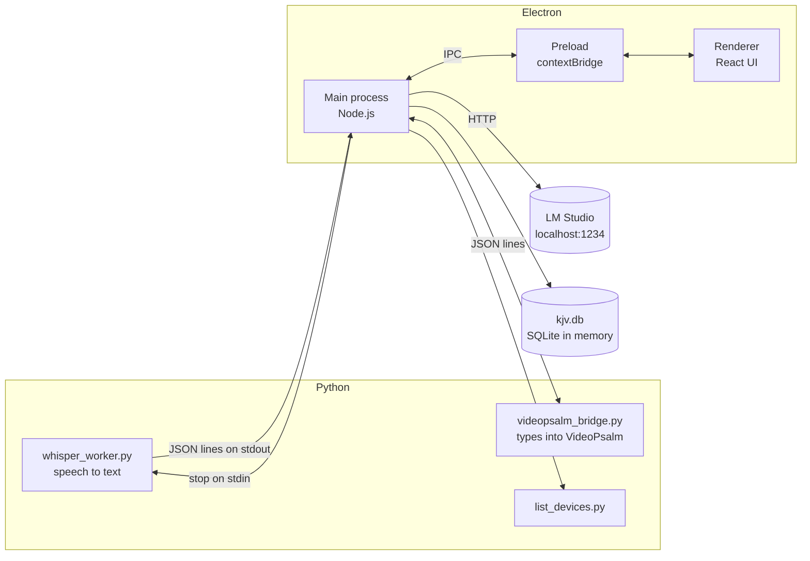

# Architecture

How the pieces fit together: which process does what, how they talk, and what happens when one of them fails.

## Contents

- [Processes](#processes)
- [Main process modules](#main-process-modules)
- [IPC contract](#ipc-contract)
- [Detection pipeline](#detection-pipeline)
- [Failure handling](#failure-handling)
- [Data, settings and logs](#data-settings-and-logs)
- [Security](#security)

---

## Processes



| Process | Language | Lifetime | Job |
|---|---|---|---|
| Main | Node.js (Electron) | App lifetime | Owns every child process, the pipeline, the database and settings |
| Renderer | React | App lifetime | Shows state and sends operator actions. Has no Node access. |
| Preload | Node.js | App lifetime | Exposes a fixed list of functions to the renderer |
| `whisper_worker.py` | Python | While listening | Captures audio, runs Whisper, prints one JSON message per line |
| `videopsalm_bridge.py` | Python | Started on first use, then kept alive | Finds VideoPsalm's reference box and types into it |
| `list_devices.py` | Python | One call | Lists usable microphones as JSON |

Python is used where the libraries are: Whisper, sounddevice and the Windows automation packages. Everything else stays in the main process so there is one place that owns state.

## Main process modules

| File | Responsibility |
|---|---|
| [`index.js`](../src/main/index.js) | App entry. IPC handlers, Whisper and bridge supervision, pipeline wiring, de-duplication |
| [`bibleExtractor.js`](../src/main/bibleExtractor.js) | Regex detection of explicit references and their confidence. Keeps the `heard` text |
| [`bookNames.js`](../src/main/bookNames.js) | The 66 books and every alias, in two tiers (see below) |
| [`bibleDb.js`](../src/main/bibleDb.js) | KJV lookup with sql.js, book-name normalisation, range capping |
| [`llmClient.js`](../src/main/llmClient.js) | LM Studio client: prompt, retry, tolerant JSON parsing |
| [`chunker.js`](../src/main/chunker.js) | Groups transcript text into 5 s chunks with overlap for the LLM |
| [`settings.js`](../src/main/settings.js) | Validated preferences in `settings.json` |
| [`logger.js`](../src/main/logger.js) | Rotating file log |

**Two alias tiers.** `bookNames.js` keeps a broad list for normalising what the LLM returns ("Ps", "1st jn") and a conservative list for scanning speech. Short forms like "am" or "is" are fine when the LLM has already said a book was meant, but in raw speech they would match "I am 3 minutes late".

## IPC contract

The renderer can only call what [`src/preload/index.js`](../src/preload/index.js) exposes.

### Renderer to main (request and response)

| Function | Channel | Returns |
|---|---|---|
| `getAudioDevices()` | `get-audio-devices` | `[{ index, name }]` or `{ error }` |
| `startListening({ model, deviceIndex })` | `start-listening` | `{ started }` |
| `stopListening()` | `stop-listening` | `{ stopped }` |
| `lookupReference(query)` | `lookup-reference` | `{ ok, cards }` or `{ ok: false, error }` |
| `sendToVideoPsalm(reference)` | `send-to-videopsalm` | `{ ok, error? }` |
| `checkVideoPsalm()` | `check-videopsalm` | `{ running }` |
| `checkLlmStatus()` | `check-llm-status` | `{ ok, model, error }` |
| `setLlmEndpoint(url)` | `set-llm-endpoint` | same as above |
| `checkBibleDb()` | `check-bible-db` | `{ ready }` |
| `getSettings()` / `saveSettings(patch)` | `get-settings` / `save-settings` | full settings object |
| `copyToClipboard(text)` | `copy-to-clipboard` | `{ ok }` |
| `getLogPath()` | `get-log-path` | path string |

### Main to renderer (events)

| Event | Payload |
|---|---|
| `transcript-update` | `{ text, is_final }` |
| `listening-status` | `{ listening?, message? }` |
| `listening-error` | `{ type: 'error' \| 'warning', message }` |
| `scripture-suggestion` | A card (below) |
| `scripture-analyzing` / `scripture-analyzing-done` | `{ chunkId, startAt?, fireAt? }` |
| `llm-error` | `{ message }` |

### A suggestion card

```js
{
  id, reference: 'Isaiah 40:31', book, chapter, verseStart, verseEnd,
  text: 'But they that wait upon the Lord ...',
  translation: 'KJV',
  confidence: 'high' | 'medium' | 'low',
  trigger: 'explicit' | 'paraphrase' | 'allusion',
  heard: 'Isaiah 40 verse 31',      // regex path only, used to mark the transcript
  chunkId, startAt, fireAt,         // LLM path: which chunk and time window it came from
  manual: true                      // typed by the operator
}
```

## Detection pipeline

1. **Transcription.** The worker records 6 s windows with 1.5 s overlap, skips silent windows (RMS gate), and keeps only Whisper segments with a no-speech probability under 0.5 and mean log-probability above -0.8. Each accepted line is printed as JSON.
2. **Fast path.** Every line goes straight through `bibleExtractor.extract()`. Explicit citations become cards in under a millisecond.
3. **Slow path.** Lines are also added to the chunker. Every 5 s, if there are at least 8 new words, the chunk and the last 160 words of context go to LM Studio. The regex runs on the same chunk, and the results are merged.
4. **De-duplication.** A reference is not suggested twice within 10 minutes.
5. **Validation.** Every reference is looked up in the KJV. Anything that does not exist ("Jude 4:5", "Isaiah 700") is dropped and logged. Ranges longer than 10 verses are cut to 10.
6. **Display.** Cards go to the renderer, newest first. The operator sends one with a number key or the Send button.

## Failure handling

A live service cannot be paused, so every dependency is allowed to fail on its own.

| What fails | What the app does |
|---|---|
| LM Studio is not running | Chip shows "off". Explicit references still work. Status is checked again every 30 s. |
| LM Studio returns cut-off JSON | Complete objects are salvaged from the truncated array. |
| Whisper falls behind real time | The audio queue drops the oldest audio instead of growing, and a warning says to use a smaller model. |
| Whisper exits or crashes | Listening stops and the UI says so. A late exit from an old process cannot stop a new session. |
| VideoPsalm hangs | Each command times out after 5 s. The bridge is killed and restarted on the next send. The status bar explains. |
| A verse does not exist | Dropped before it reaches the screen, and logged. |
| The KJV database is missing | The KJV chip shows "missing" and the empty queue says how to fix it. |
| Settings file is corrupt | Defaults are used. Unknown keys and bad values are ignored. |

## Data, settings and logs

| What | Where |
|---|---|
| Bible database | `bible-data/kjv.db`, built by `npm run setup-bible` (31,102 verses). Loaded into memory on first lookup. |
| Settings | `settings.json` in Electron's userData folder (`%APPDATA%\scripture-app` on Windows) |
| Logs | `logs/scripture-app.log` in the same folder. Rotates at 5 MB, keeps 3 files. |

## Security

- `contextIsolation` is on. The renderer has no Node access and can only call the functions listed above.
- The renderer loads local files only. There is no remote content.
- The only network traffic is to the LM Studio endpoint, which is `localhost` by default. No audio or text leaves the machine.
- Settings are validated on load, so a hand-edited file cannot inject arbitrary values.
