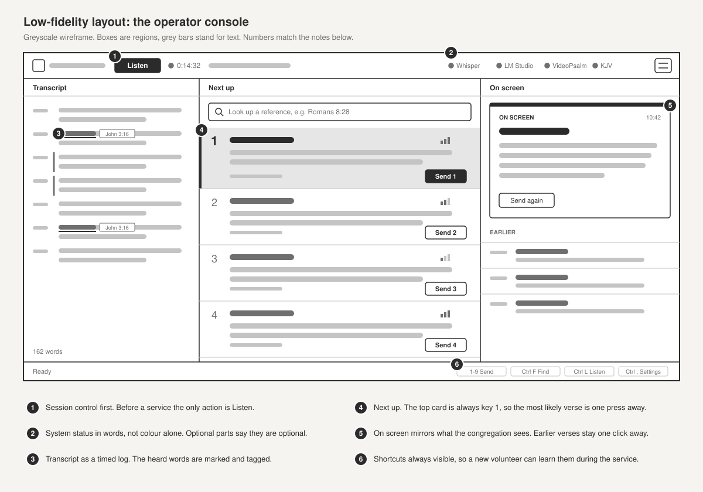
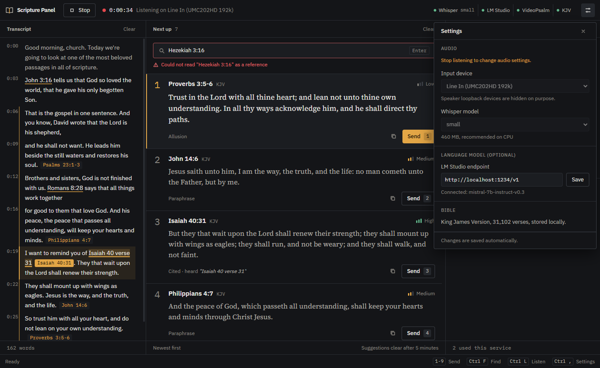
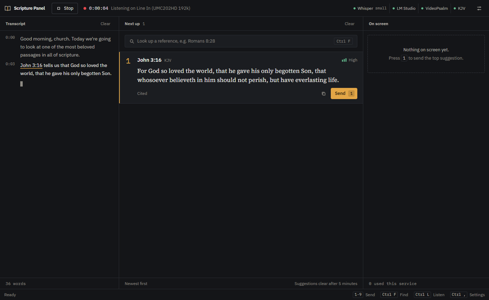
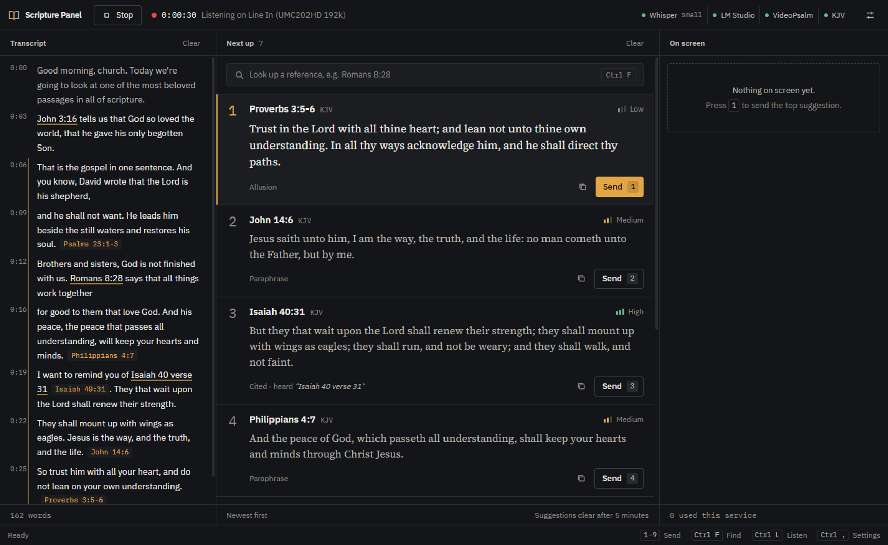
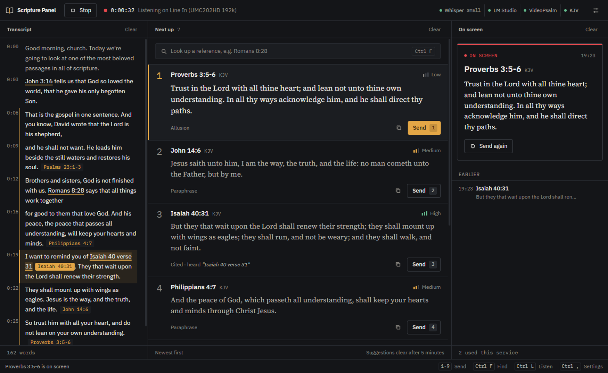
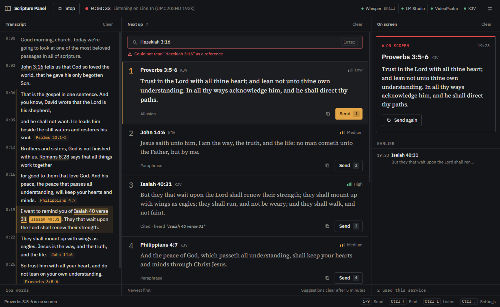
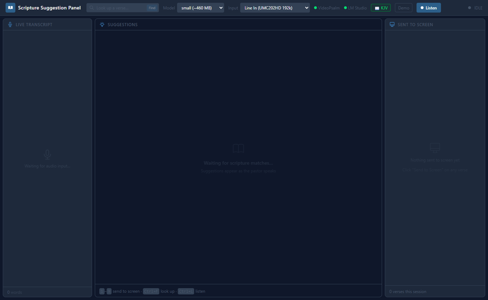
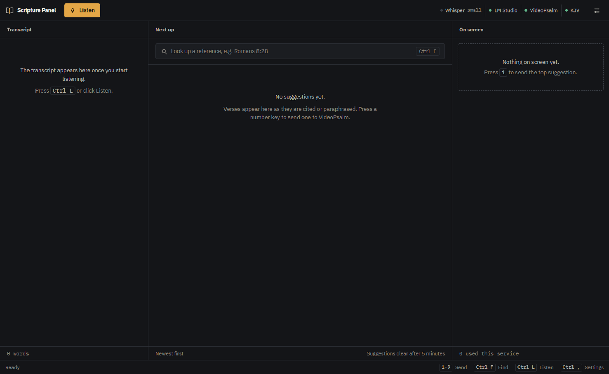
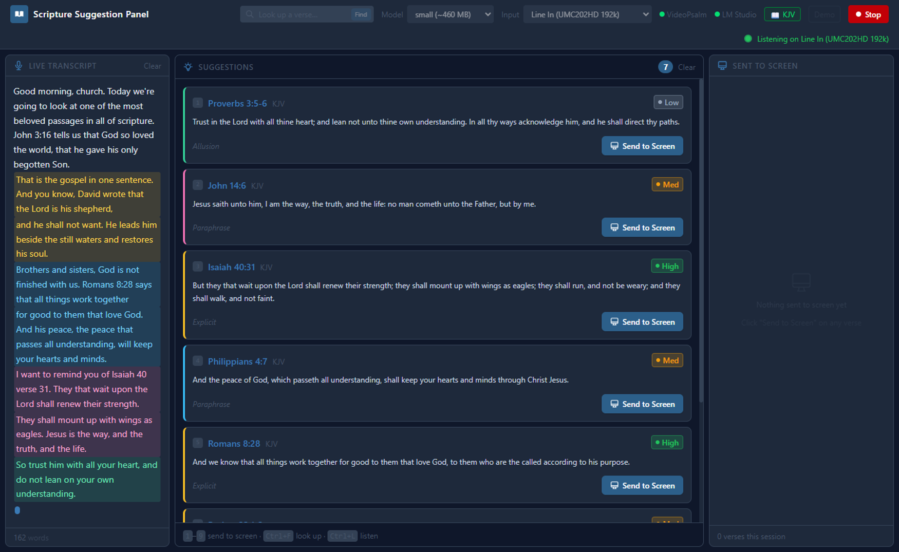
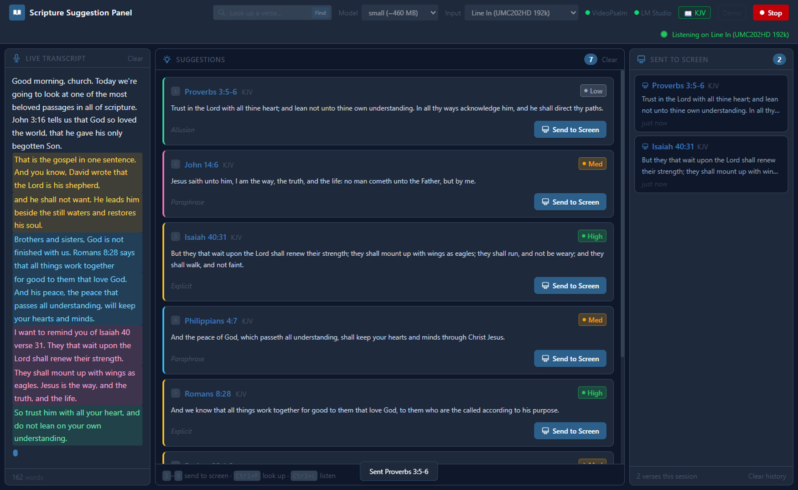

# Design

How the operator console went from a working prototype to a tool that is calm to use during a live service. This covers who it is for, the low-fidelity wireframes and flow, the high-fidelity result, and the visual system behind it.

## Contents

- [The problem, seen from the booth](#the-problem-seen-from-the-booth)
- [Design goals](#design-goals)
- [Low fidelity](#low-fidelity)
- [From low to high fidelity](#from-low-to-high-fidelity)
- [Before and after](#before-and-after)
- [Visual system](#visual-system)
- [Components](#components)
- [Accessibility](#accessibility)
- [How the screenshots are made](#how-the-screenshots-are-made)
- [What I would test next](#what-i-would-test-next)

---

## The problem, seen from the booth

This started in my own church. During services the scripture often reached the screen late, and sometimes not at all. When the preacher says "turn to John 3:16" the media team can keep up. But very often the man of God quotes a verse, or paraphrases it, without naming it, and someone in the booth has to recognise it, find it and put it up before the moment has passed.

The person doing that is usually a volunteer. While the sermon is going they are:

- listening to the pulpit and watching the congregation screen at the same time,
- working in presentation software (VideoPsalm) on a second monitor,
- sitting in a dim room, often with the keyboard in their lap,
- under time pressure: a verse that arrives ten seconds late has missed its moment.

So the app is not something they read. It is something they glance at. Every design decision below comes from that.

## Design goals

| Goal | What it means in the interface |
|---|---|
| **Glanceable** | The most likely verse is in the same place every time, big enough to read from arm's length. |
| **One key to act** | The top suggestion is always key `1`. No mouse needed for the common case. |
| **Show why** | Every card says how it was detected and what was heard, so the operator can trust it or ignore it quickly. |
| **Never block the service** | If the language model, VideoPsalm or the microphone fails, the rest keeps working and the problem is stated plainly. |
| **Quiet** | It sits next to presentation software in a dark room. No bright panels, no decoration, colour only where it carries meaning. |

## Low fidelity

I sketched the layout and the operator's path before touching any styles. These are greyscale on purpose: at this stage the question is where things go and what the operator does, not what they look like.

### Layout



Three columns follow the operator's reading order, left to right: what was said, what could go up next, what is up now. This borrows the preview and program idea from broadcast tools, which church media volunteers already know from their mixers and presentation software.

### Operator flow


The main path is five steps and only one of them (pressing `1`) happens during the sermon. The second row covers what happens when something goes wrong, because in a live service those moments decide whether the tool is trusted.

## From low to high fidelity

Each storyboard frame maps to a real screen. The screenshots below are the finished app playing back a recorded session (see [how the screenshots are made](#how-the-screenshots-are-made)).

| Storyboard frame | Finished screen |
|---|---|
| **1 Set up.** Choose the input device and model once. They are saved for next week, and the panel explains what each choice means. |  |
| **2 to 3 Listen, verse detected.** The transcript streams in as a timed log. The heard words ("John 3:16") are underlined and the verse becomes card 1. |  |
| **3 Queue fills.** Newest first. Card 1 is emphasised. Paraphrases are tied to the transcript lines they came from. |  |
| **4 to 5 Press 1, on screen.** The verse moves to On screen with a red on-air bar. The previous verse moves to Earlier and can be sent again in one click. |  |
| **Hover to check the source.** Pointing at a card highlights exactly where it came from in the transcript. Here, Isaiah 40:31 and the words "Isaiah 40 verse 31". |  |
| **Detection misses.** The operator types the reference. If it cannot be read, the reason appears right under the box, not in a popup. |  |

## Before and after

Both sets of screenshots come from the **same recorded session at the same moments**, so the comparison is fair. The "before" is release 1.0.0.

| Before (1.0.0) | After (1.1.0) |
|---|---|
|  |  |
|  |  |
|  |  |

What changed, and why:

| Before | After | Why |
|---|---|---|
| Transcript lines painted in six rotating colours, matched to cards by eye | A timed log. The exact heard words are underlined and tagged with the reference | Colour matching fails with more than a few cards and for colour-blind operators. Words and references do not. |
| Every card looked the same | Card 1 is larger, lit and carries the accent. Its Send button is the only filled button | The most likely action should be the most visible one. |
| Verse text in the UI font at 12 px | Verse text in a book serif at 16 to 17 px | Scripture is the content the operator is checking. It should read like a Bible, not like a label. |
| Confidence as a coloured pill (green, amber, grey) | A three-step bar plus the word | Readable without colour, and in a dark room. |
| Model, input and endpoint in the header all the time | In a settings panel (`Ctrl+,`) | They are chosen before the service, not during it. Removing them from view cuts the header in half. |
| Status as coloured dots and an emoji badge | Four named status chips, with optional parts saying they are optional | "LM Studio off" is normal. The old red dot made it look like an error. |
| "Sent to Screen" as a list of equal cards | On screen: the live verse with an on-air bar, then Earlier | Operators think in preview and program. What is live must be unmistakable. |
| Floating toast and a red banner that pushed the layout down | A status bar that always holds the last message and the shortcuts | Nothing moves while someone is reading. The shortcuts teach themselves. |
| A Demo button in the live header | Removed | A live tool should never have a way to show fake verses by accident. The screenshots use a separate harness instead. |
| Slate and indigo defaults, rounded cards everywhere, emoji | Neutral charcoal, 1 px rules, 4 px radii, one icon set | It should look like a tool that belongs next to broadcast software, not a template. |

## Visual system

All tokens live in [`src/renderer/src/index.css`](../src/renderer/src/index.css).

### Colour

A neutral charcoal ramp with no blue tint, so it does not fight the presentation software. One amber accent means "next" or "focus". Red means one thing only: on screen now.

| Token | Hex | Use | Contrast on panel (`ink-1`) |
|---|---|---|---|
| `ink-0` | `#0d0e10` | App background, gutters | |
| `ink-1` | `#141518` | Panels | |
| `ink-2` | `#1b1d21` | Inputs, hover, the top card | |
| `line` | `#2a2d33` | Hairlines between regions | |
| `fg` | `#ecebe7` | References, verse text | 15.3 : 1 |
| `fg-2` | `#b9b6ae` | Transcript, labels | 9.0 : 1 |
| `fg-3` | `#8d8a83` | Meta, hints | 5.3 : 1 |
| `accent` | `#e3a646` | Next up, focus, primary button | 8.5 : 1 |
| `live` | `#e5484d` | On screen | 4.7 : 1 |
| `ok` / `err` | `#62b88c` / `#ef6b6f` | Status | 7.6 : 1 / 6.1 : 1 |

Every text colour meets WCAG 2.1 AA (4.5 : 1) on the panel colour. Red measures 4.3 : 1 on the raised surface, so red text is only ever placed on `ink-1`.

### Type

| Family | Used for | Why |
|---|---|---|
| IBM Plex Sans | Interface | Clear at small sizes, neutral, open licence |
| IBM Plex Mono | References in tags, hotkeys, times, counts | Numbers line up, and it reads as "data" next to prose |
| Source Serif 4 | Verse text | Scripture should read like a printed Bible |

Fonts are bundled with the app (Latin subsets only) so a booth PC without internet looks the same. Sizes: 11 px meta, 12 px labels, 13 px body, 14 px transcript, 15 px references, 16 to 17 px verses, 19 px live verse, 22 px hotkeys.

### Shape, space and motion

- 1 px rules separate regions. Panels touch instead of floating as cards.
- 3 to 4 px radii. Larger radii read as consumer apps.
- An 8 px spacing rhythm with 16 px panel padding.
- One icon set drawn on a 16 px grid with a 1.5 px stroke ([`Icon.jsx`](../src/renderer/src/components/Icon.jsx)).
- New cards and lines ease in over 180 ms so arrivals are noticed. Nothing else moves, and all motion stops when the system asks for reduced motion.

## Components

| Component | Role |
|---|---|
| [`TopBar`](../src/renderer/src/components/TopBar.jsx) | Listen or Stop, session clock, status chips, settings |
| [`SettingsPanel`](../src/renderer/src/components/SettingsPanel.jsx) | Input device, Whisper model, LM Studio endpoint, Bible status |
| [`Panel`](../src/renderer/src/components/Panel.jsx) | Shared column frame, so headers and footers line up |
| [`TranscriptPanel`](../src/renderer/src/components/TranscriptPanel.jsx) | Timed log, heard phrases, links to cards |
| [`SuggestionPanel`](../src/renderer/src/components/SuggestionPanel.jsx) | Next up queue and the lookup box |
| [`ScriptureCard`](../src/renderer/src/components/ScriptureCard.jsx) | One suggestion: hotkey, reference, verse, confidence, source, Send |
| [`ManualSearch`](../src/renderer/src/components/ManualSearch.jsx) | Typed lookup with inline errors |
| [`OnScreenPanel`](../src/renderer/src/components/OnScreenPanel.jsx) | Live verse and earlier verses |
| [`StatusBar`](../src/renderer/src/components/StatusBar.jsx) | Last message and the shortcuts |
| [`Icon`](../src/renderer/src/components/Icon.jsx) | The icon set |

## Accessibility

- Text contrast meets WCAG 2.1 AA throughout (table above).
- Confidence, status and errors never rely on colour alone: each has a word, and confidence also has a bar count.
- Everything can be done from the keyboard: `1` to `9`, `Ctrl+F`, `Ctrl+L`, `Ctrl+,`, `Esc`. Focus is always visible as a 2 px amber outline.
- Icon-only buttons have labels. The status bar is an `aria-live` region, and lookup errors use `role="alert"`.
- Motion respects `prefers-reduced-motion`.

## How the screenshots are made

The demo mode was removed from the app, so screenshots come from a harness instead:

- [`scripts/fixtures/sample-session.json`](../scripts/fixtures/sample-session.json) is a recorded-style session. Its cited references were produced by running the real extractor and KJV lookup over the transcript lines.
- [`scripts/screenshot-preload.js`](../scripts/screenshot-preload.js) replaces the real preload and replays that session through the same callbacks the main process uses.
- [`scripts/capture-screenshots.js`](../scripts/capture-screenshots.js) drives the UI like an operator (click Listen, press 3, press 1, hover, type) and saves each state.

To regenerate the "after" set:

```bash
npm run screenshots
```

The same harness can load an older build, which is how the "before" set was captured from release 1.0.0. The steps are in [development.md](development.md#screenshots).

## What I would test next

- **Watch it used in a real service.** Record where the operator's eyes and hands go, and how long from "heard" to "on screen".
- **Text size control.** Some booths are far from the monitor.
- **A light theme** for rooms that are not dark.
- **Colour-blind check** of the ok and warn colours with a simulator, even though they are never the only signal.
